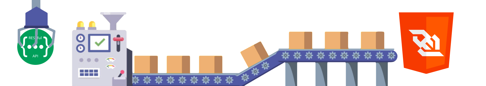

# 📦  easy-wsapiproxy

This package will help you to send requests to web socket using a simple API rest. 
Useful for development proposes, using this tool you can send socket.io requests from postman or similar tools and get the result 

## Install

```npm
npm install -g easy-wsapiproxy@latest
```

# Usage

1. Install the npm wsapiproxy

2. Run the tool

```bash
easy-wsapiproxy <api-port>
```
3. Send a post with the following body

``` json

{
  "url": "http://", // 👉 http or ws
  "emitter": "", // 👉 event name
  "listeners": [], // 👉 list of listeners
  "headers":  { // 👉 key, value pair object
    "Authorization": "bearer XXXXX.XXXXX.....",
  },
  "argument": {} // 👉 Object to request
}

```

3. Result structure

``` json

{
  "response": { 
    "listener" : "", // 👉 What listener response
    "result": {} // 👉 The result from the websocket
  }, 
  "_request": {}, // 👉 The request you sent,
}

```


# Contributing
If someone wants to add or improve something, I invite you to collaborate directly in this repository: [easy-wsapiproxy](https://github.com/ariassd/easy-wsapiproxy)


### How to run the npm
- Clone the repository.
- Install dependencies.
- Make your changes.
- Run the command `npm run start:dev <api-port>`.
- Happy programming


## Status

Project: _in progress_
Thank you for using this NPM

## Stay in touch

- Author - Luis Arias 2021 <<ariassd@gmail.com>>
  [GitHub profile](https://github.com/ariassd)

## License

This software is licensed under [MIT License](LICENSE)

 

May 2021
